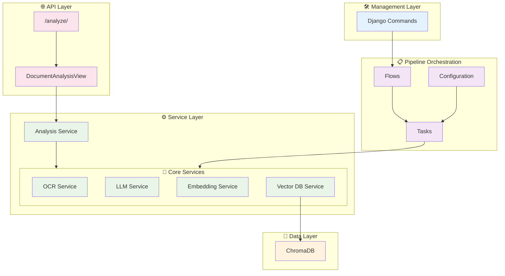

<div align="center">

# 📄 SmartDoc
#### **An AI-powered solution for automatic document classification and extracting structured data from scanned documents**

---

### 👨‍💻 Author

**Ivan Yang Rodriguez Carranza**

[](mailto:ivanrodcar@outlook.com)
[](https://www.linkedin.com/in/irodcar)
[](https://github.com/rodcar)

</div>

---

## 📋 Table of Contents

- [🎯 Problem Definition](#-problem-definition)
- [🔬 Methodology](#-methodology)
- [📝 Requirements](#-requirements)
- [🏗️ Architecture](#️-architecture-design)
- [⚙️ Implementation](#️-implementation)
- [🧪 Testing](#-testing)
- [🚀 Setup & Usage](#-setup--usage)
- [📊 Sample Outputs](#-sample-outputs)

---

## 🎯 Problem Definition

Organizations daily handle vast amounts of paper-based documents (invoices, forms, contracts, receipts, and reports) that contain valuable structured data trapped in image format. Manual data entry from these documents is time-consuming, error-prone, and expensive, while existing OCR solutions often lack the intelligence to automatically classify document types and extract data in a structured, usable format. SmartDoc addresses this challenge by providing an AI-powered solution that not only accurately extracts text from scanned documents but also intelligently classifies them and organizes the extracted data into structured formats, enabling organizations to digitize their document workflows efficiently and reliably.

---

## 🔬 Methodology

The project is built step-by-step through four main stages, as shown in the diagram below:


---

## 📝 Requirements

The following table outlines all project requirements organized by category, with unique identifiers and priority levels to guide testing:


| Category | ID | Description | Testing Priority |
|----------|-----|-------------|----------|
| 🔧 **Functional** | FR-001 | Accept image uploads (.jpg) of scanned documents | Low |
| 🔧 **Functional** | FR-002 | Perform OCR text extraction from document images | High |
| 🔧 **Functional** | FR-003 | Automatically identify document types (invoice, form, contract, etc.) | High |
| 🔧 **Functional** | FR-004 | Extract key entities from documents | High |
| 🔧 **Functional** | FR-005 | Provide API endpoint for document type identification and entity extraction | Medium |
| 🔧 **Functional** | FR-006 | Pipeline processing of multiple document images | Medium |
| 🔧 **Functional** | FR-007 | Save document, document type and extracted entities in database | Medium |
| ⚡ **Performance** | NFR-001 | Average processing time per document in pipeline less than 1 second | Medium |
| ⚡ **Performance** | NFR-002 | Achieve minimum 70% accuracy for document classification | High |
| ⚡ **Performance** | NFR-003 | Embedding processing optimized for MPS hardware acceleration | Low |
| 🔧 **Maintainability** | NFR-004 | Easy configuration to change OCR, LLM, embedding, or database providers | Medium |
| 📈 **Scalability** | NFR-005 | Pipeline architecture designed for future scalability and horizontal scaling | Low |
| 🛠️ **Technical** | TR-001 | Django framework implementation | Low |
| 🛠️ **Technical** | TR-002 | Django APIView for single document type classification and entity extraction endpoint | Low |
| 🛠️ **Technical** | TR-003 | Django management commands for pipeline processing | Low |
| 🛠️ **Technical** | TR-004 | ChromaDB integration for storing documents and extracted entities | Low |


---

## 🏗️ Architecture Design

### 🔧 Core Building Blocks

The architecture is organized into a layered architecture with five main components:

| Component | Description | Design Rationale | Requirements |
|-----------|-------------|------------------|--------------|
| 🛠️ **Management Layer** | Contains Django management command for pipeline processing of multiple document images | Command class with separate configuration class design enables flexible argument handling | TR-003, FR-006, TR-001 |
| 🌐 **API Layer** | Exposes an `/analyze/` endpoint for document classification and entity extraction | View class with request handler design separates HTTP processing from business logic | FR-001, FR-005, TR-002 |
| 📋 **Pipeline Orchestration** | Orchestrates a configurable document processing workflow through parallel tasks | Modular design enabling flexible workflow configuration and parallel processing with Prefect for future scalability | NFR-001, NFR-005 |
| ⚙️ **Service Layer** | Provides modular services for OCR text extraction, LLM inference, embeddings generation, and document analysis | Modular architecture for testability with reuse across API layer and Django commands to avoid duplication of responsibilities and allows to easily add more providers for any service (OCR, LLM, embedding, vector DB) | FR-002, FR-003, FR-004, NFR-004, NFR-003, NFR-002 |
| 💾 **Data Layer** | Stores documents, document types and extracted entities using ChromaDB vector database | ChromaDB interface enables simple indexing and similarity search of data with support for implementing other vector databases in this layer | FR-007, TR-004 |

### 📊 Architecture Diagram



---

## ⚙️ Implementation

### 🛠️ Technology Stack
- **Backend**: Python 3.11+
- **Web Framework**: Django + Django REST Framework
- **OCR**: Tesseract
- **Workflow Orchestration**: Prefect
- **Vector Database**: ChromaDB
- **AI**: OpenAI Responses API
- **Embedding Models**: SentenceTransformer (all-MiniLM-L6-v2), OpenCLIP

### 📁 Project Structure
```
smartdoc/
├── api/                          # Django app with core functionality
│   ├── management/               # Django management commands
│   │   └── commands/            # Custom commands (process_documents)
│   ├── pipelines/               # Workflow orchestration
│   │   ├── tasks/              # Individual processing tasks
│   │   ├── flows/              # Prefect workflow definitions
│   │   └── config/             # Pipeline configuration
│   ├── services/               # Service module
│   │   ├── embedding/          # Embedding generation services
│   │   ├── llm/               # LLM inference services
│   │   ├── ocr/               # OCR text extraction services
│   │   ├── analysis/          # Classification and entity extraction for endpoint
│   │   └── vectordb/          # Vector database operations
│   ├── data/                  # Data module
│   └── views.py              # API endpoints
├── smartdoc/                  # Django project settings
├── tests/                    # Test suite for the application
├── notebooks/                # Development and testing notebooks
├── chromadb/                # ChromaDB vector database storage
```

*Note: This shows the key directories and files, additional files are not displayed for clarity.

---

## 🧪 Testing

### 📋 Test Design

#### 📋 Tests for High Priority Requirements

| Test ID | Test Case | Expected Outcome | Requirement ID |
|---------|-----------|------------------|----------------|
| **UT-001** | OCR Text Extraction | OCR service extracts readable text from uploaded document images | FR-002 |
| **UT-002** | Document Classification | LLM service correctly identifies document types (invoice, form, contract) with >70% accuracy | FR-003 |
| **UT-003** | Entity Extraction | Analysis service extracts key entities (dates, amounts, names) with structured output | FR-004 |

#### ⚡ Performance Testing for High Priority Performance Requirements

| Test ID | Performance Test | Success Criteria | Requirement ID |
|---------|------------------|------------------|----------------|
| **PT-001** | Classification Accuracy | System achieves minimum 70% accuracy when classifying document types | NFR-002 |

### 📊 Quality Metrics
- **Performance Benchmarks**: 
  - Classification accuracy: ≥70% minimum threshold
- **Test Success Criteria**: 
  - OCR text extraction: Readable text output from document images
  - Entity extraction: Structured data output (dates, amounts, names)
  - Document classification: Correct identification of invoice, form, letter, memo, resume, budget, email, presentation, scientific report, and other document types

---

## 🚀 Setup & Usage

### 📋 Prerequisites
- **Python 3.8+**
- **Tesseract OCR**

### 🔧 Quick Installation

```bash
# 1. Clone and setup
git clone https://github.com/rodcar/smartdoc.git
cd smartdoc
python -m venv .venv
source .venv/bin/activate  # Windows: .venv\Scripts\activate

# 2. Install dependencies
pip install -r requirements.txt

# 3. Install Tesseract OCR
# macOS: brew install tesseract
# Ubuntu: sudo apt-get install tesseract-ocr

# 4. Setup database
python manage.py migrate
```

### 🎯 Usage

#### API Endpoint
```bash
# Start server
python manage.py runserver

# Test API
curl -X POST http://localhost:8000/analyze/ \
  -F "file=@document.jpg"
```

**Response:**
```json
{
  "document_type": "invoice",
  "entities": {
    "total_amount": "150.00",
    "date": "2024-01-15",
    "vendor": "ABC Company"
  },
  "confidence": 0.85
}
```

#### Batch Processing
```bash
# Process multiple documents
python manage.py process_documents /path/to/documents/
```

#### Running Tests
```bash
# Set dataset path for tests
export SMARTDOC_DATASET_PATH=/path/to/docs-sm

# Run all tests
python manage.py test tests
```

---

## 📊 Sample Outputs

### 🧾 Invoice Processing
**Input:** `invoice_sample.jpg`
```json
{
  "document_type": "invoice",
  "confidence": 0.92,
  "entities": {
    "vendor_name": "ABC Company",
    "invoice_number": "INV-2024-001",
    "invoice_date": "2024-01-15",
    "total_amount": 132.00,
    "currency": "USD"
  }
}
```

### 📋 Form Processing
**Input:** `application_form.jpg`
```json
{
  "document_type": "application_form",
  "confidence": 0.88,
  "entities": {
    "applicant_name": "Sarah Johnson",
    "phone_number": "(555) 123-4567",
    "email": "sarah.johnson@email.com",
    "address": "456 Oak Avenue, Springfield, IL 62701"
  }
}
```

---

## 🔮 Future Development

### 🔧 Extending Functionality

SmartDoc's modular architecture makes it easy to extend and customize:

#### 📝 Adding New Document Types
```python
# In api/services/analysis/document_classifier.py
def classify_document(self, text: str) -> str:
    # Add new document types to the classification logic
    new_types = ["receipt", "tax_document", "legal_contract"]
    # Update classification prompt or model
```

#### 🔌 Adding New Service Providers
SmartDoc's modular design allows you to easily swap out different service providers without changing the core logic. For example, you can replace Tesseract OCR with Google Vision API, or switch from OpenAI to local LLM models. Simply create a new service class that follows the same interface, then update the configuration settings to use your preferred provider.

#### 🔄 Adding New Workflows
The Prefect-based pipeline system lets you create custom document processing workflows for different use cases. You can build specialized workflows by adding new flow definitions in the `api/pipelines/flows/` folder, create custom processing tasks in the `api/pipelines/tasks/` folder, and configure workflow settings in `api/pipelines/config/`.