<div align="center">

# 📄 SmartDoc
#### **An AI-powered solution for automatic document classification and extracting structured data from scanned documents**

---

### 👨‍💻 Author

**Ivan Yang Rodriguez Carranza**

[](mailto:ivanrodcar@outlook.com)
[](https://www.linkedin.com/in/irodcar)
[](https://github.com/rodcar)

</div>

---

## 📋 Table of Contents

- [🎯 Problem Definition](#-problem-definition)
- [🔬 Methodology](#-methodology)
- [📝 Requirements](#-requirements)
- [📋 Test Plan](#-test-plan)
- [🏗️ Architecture Design](#️-architecture-design)
- [⚙️ Implementation](#️-implementation)
- [🧪 Testing Results](#-testing-results)
- [🚀 Setup & Usage](#-setup--usage)
- [🔮 Future Development](#-future-development)

---

## 🎯 Problem Definition

Organizations daily handle vast amounts of paper-based documents (invoices, forms, contracts, receipts, and reports) that contain valuable structured data trapped in image format. Manual data entry from these documents is time-consuming, error-prone, and expensive, while existing OCR solutions often lack the intelligence to automatically classify document types and extract data in a structured, usable format. SmartDoc addresses this challenge by providing an AI-powered solution that not only accurately extracts text from scanned documents but also intelligently classifies them and organizes the extracted data into structured formats, enabling organizations to digitize their document workflows efficiently and reliably.

---

## 🔬 Methodology

The project is built step-by-step through four main stages, as shown in the diagram below:

```mermaid
graph LR
    A[📋 Requirements
    +
    📋Test Plan] --> B[🏗️ Architecture Design]
    B --> C[⚙️ Implementation]
    C --> D[🧪 Testing]
    
    style A fill:#e1f5fe
    style B fill:#f3e5f5
    style C fill:#e8f5e8
    style D fill:#fff3e0
```



---

## 📝 Requirements

The following table outlines all project requirements organized by category, with unique identifiers and priority levels to guide testing:


| Category | ID | Description | Testing Priority |
|----------|-----|-------------|----------|
| 🔧 **Functional** | FR-001 | Accept image uploads (.jpg) of scanned documents | Low |
| 🔧 **Functional** | FR-002 | Perform OCR text extraction from document images | High |
| 🔧 **Functional** | FR-003 | Automatically identify document types (invoice, form, contract, etc.) | High |
| 🔧 **Functional** | FR-004 | Extract key entities from documents | High |
| 🔧 **Functional** | FR-005 | Provide API endpoint for document type identification and entity extraction | High |
| 🔧 **Functional** | FR-006 | Pipeline processing of multiple document images | Medium |
| 🔧 **Functional** | FR-007 | Save document, document type and extracted entities in database | Medium |
| ⚡ **Performance** | NFR-001 | Average processing time per document in pipeline less than 1 second | Medium |
| ⚡ **Performance** | NFR-002 | Achieve minimum 70% accuracy for document classification | High |
| ⚡ **Performance** | NFR-003 | Achieve minimum 70% precision and recall for entity extraction | High |
| ⚡ **Performance** | NFR-004 | Embedding processing optimized for MPS hardware acceleration | Low |
| 🔧 **Maintainability** | NFR-005 | Easy configuration to change OCR, LLM, embedding, or database providers | Medium |
| 📈 **Scalability** | NFR-005 | Pipeline architecture designed for future scalability and horizontal scaling | Low |
| 🛠️ **Technical** | TR-001 | Django framework implementation | Low |
| 🛠️ **Technical** | TR-002 | Django APIView for single document type classification and entity extraction endpoint | Low |
| 🛠️ **Technical** | TR-003 | Django management commands for pipeline processing | Low |
| 🛠️ **Technical** | TR-004 | ChromaDB integration for storing documents and extracted entities | Low |

## 📋 Test Plan

### 🎯 Test Strategy

The testing strategy includes three types of tests:

- **Smoke Tests**: Validate core high-priority testing requirements functionality and provide rapid failure detection.
- **Performance Tests**: Validates that the workflow and endpoint meet performance requirements.
- **Evaluations**: Evaluate the two main features (document processing pipeline and classification/entity extraction endpoint) through real-world scenarios to assess practical effectiveness.

### 📝 Test Design

#### 📋 Smoke Tests

| Test ID | Test Case | Expected Outcome | Requirement ID |
|---------|-----------|------------------|----------------|
| **ST-001** | OCR Text Extraction | OCR service extracts readable text from uploaded document images | FR-002 |
| **ST-002** | Document Classification | LLM service correctly identifies document types (invoice, form, contract) with >70% accuracy | FR-003 |
| **ST-003** | Entity Extraction | Analysis service extracts key entities (dates, amounts, names) with structured output | FR-004 |
| **ST-004** | API Endpoint Functionality | API endpoint accepts document image uploads and returns document type and extracted entities in JSON format | FR-005 |
| **ST-005** | Document Type Classification | System correctly identifies 4 document types | NFR-002 |

#### ⚡️ Performance Tests

| Test ID | Test Case | Expected Outcome | Requirement ID |
|---------|-----------|------------------|----------------|
| **PT-001** | Pipeline Processing Performance | System processes 5000 documents through the pipeline in maximum 30 minutes (average <0.36 seconds per document) | NFR-001|
| **PT-002** | API Endpoint Response Time | Single document analysis via `/analyze/` endpoint has average response time less than 5 seconds for standard document sizes | NFR-001|

**Note**: Performance benchmarks are based on testing with MacBook Pro M4 with 14 cores. Results may vary depending on hardware and provider configurations.

#### 📊 Evaluations

| Test ID | Test Case | Expected Outcome | Requirement ID |
|---------|-----------|------------------|----------------|
| **EV-001** | Endpoint Classification Accuracy | Using dataset split (70% indexed, 15% for testing ~700 documents, 15% for validation), endpoint achieves ≥70% accuracy in document classification | NFR-002, FR-003, FR-006 |
| **EV-002** | Entity Extraction Precision & Recall | Using a test set of 100 documents with ground truth annotations, achieves Precision ≥ 0.70 (correctly extracted entities / total extracted entities) and Recall ≥ 0.70 (correctly extracted entities / total ground truth entities) | FR-004, NFR-003 |

## 🏗️ Architecture Design

### 🔧 Core Building Blocks

The architecture is organized into a layered architecture with five main components:

| Component | Description | Design Rationale | Requirements |
|-----------|-------------|------------------|--------------|
| 🛠️ **Management Layer** | Contains Django management command for pipeline processing of multiple document images | Command class with separate configuration class design enables flexible argument handling | TR-003, FR-006, TR-001 |
| 🌐 **API Layer** | Exposes an `/analyze/` endpoint for document classification and entity extraction | View class with request handler design separates HTTP processing from business logic | FR-001, FR-005, TR-002 |
| 📋 **Pipeline Orchestration** | Orchestrates a configurable document processing workflow through parallel tasks | Modular design enabling flexible workflow configuration and parallel processing with Prefect for future scalability | NFR-001, NFR-005 |
| ⚙️ **Service Layer** | Provides modular services for OCR text extraction, LLM inference, embeddings generation, and document analysis | Modular architecture for testability with reuse across API layer and Django commands to avoid duplication of responsibilities and allows to easily add more providers for any service (OCR, LLM, embedding, vector DB) | FR-002, FR-003, FR-004, NFR-004, NFR-003, NFR-002 |
| 🔌 **Providers** | Implements specific service providers (OCR, LLM, Embedding, Vector DB) and allows for easy addition of new providers | Interface-based design enables plug-and-play replacement of providers without changing service layer implementation | NFR-005 |
| 💾 **Data Layer** | Stores documents, document types and extracted entities using ChromaDB vector database | ChromaDB interface enables simple indexing and similarity search of data with support for implementing other vector databases in this layer | FR-007, TR-004 |

### 🏛️ Architecture Diagram

```mermaid
graph TB
    subgraph "🛠️ Management Layer"
        CMD[Django Commands]
    end
    
    subgraph "🌐 API Layer"
        API[DocumentAnalysisView]
        ENDPOINT["/analyze/"]
    end
    
    subgraph "📋 Pipeline Orchestration"
        TASKS[Tasks]
        CONFIG[Configuration]
        FLOWS[Flows]
    end
    
    subgraph "⚙️ Service Layer"
        ANALYSIS[Analysis Service]
        subgraph CORE_SERVICES ["🔧 Core Services"]
            OCR[OCR Service]
            LLM[LLM Service]
            EMB[Embedding Service]
            VDB[Vector DB Service]
        end
    end
    
    subgraph PROVIDERS ["🔌 Providers"]
        OCR_PROV[OCR Provider]
        LLM_PROV[LLM Provider]
        EMB_PROV[Embedding Provider]
        VDB_PROV[Vector DB Provider]
        OTHER[Other Providers]
    end
    
    subgraph "💾 Data Layer"
        CHROMA[ChromaDB]
    end
    
    ENDPOINT --> API
    CMD --> FLOWS
    FLOWS --> TASKS
    CONFIG --> TASKS
    API --> ANALYSIS
    ANALYSIS --> CORE_SERVICES
    TASKS --> CORE_SERVICES
    OCR --> OCR_PROV
    LLM --> LLM_PROV
    EMB --> EMB_PROV
    VDB --> VDB_PROV
    VDB_PROV --> CHROMA
    
    style CMD fill:#e3f2fd
    style API fill:#fce4ec
    style ENDPOINT fill:#fce4ec
    style FLOWS fill:#f3e5f5
    style TASKS fill:#f3e5f5
    style CONFIG fill:#f3e5f5
    style OCR fill:#e8f5e8
    style LLM fill:#e8f5e8
    style EMB fill:#e8f5e8
    style ANALYSIS fill:#e8f5e8
    style VDB fill:#e8f5e8
    style OCR_PROV fill:#fff3e0
    style LLM_PROV fill:#fff3e0
    style EMB_PROV fill:#fff3e0
    style VDB_PROV fill:#fff3e0
    style OTHER fill:#fff3e0
    style CHROMA fill:#fff3e0
```



---

## ⚙️ Implementation

### 🛠️ Technology Stack
- **Backend**: Python 3.11+
- **Web Framework**: Django + Django REST Framework
- **OCR**: Tesseract
- **Workflow Orchestration**: Prefect
- **Vector Database**: ChromaDB
- **AI**: OpenAI Responses API
- **Embedding Models**: SentenceTransformer (all-MiniLM-L6-v2), OpenCLIP

### 📁 Project Structure
```
smartdoc/
├── api/                          # Django app with core functionality
│   ├── management/               # Django management commands
│   │   └── commands/            # Custom commands (process_documents)
│   ├── pipelines/               # Workflow orchestration
│   │   ├── tasks/              # Individual processing tasks
│   │   ├── flows/              # Prefect workflow definitions
│   │   └── config/             # Pipeline configuration
│   ├── services/               # Service module
│   │   ├── embedding/          # Embedding generation services
│   │   ├── llm/               # LLM inference services
│   │   ├── ocr/               # OCR text extraction services
│   │   ├── analysis/          # Classification and entity extraction for endpoint
│   │   └── vectordb/          # Vector database operations
│   ├── data/                  # Data module
│   └── views.py              # API endpoints
├── smartdoc/                  # Django project settings
├── tests/                    # Test suite for the application
├── notebooks/                # Development and testing notebooks
├── logs/                     # Output log examples from processing and testing
├── chromadb/                # ChromaDB vector database storage
```

**Note:** This shows the key directories and files, additional files are not displayed for clarity.

### 📝 Database Design

**Collection Purposes:**
- **`smartdoc_documents`**: Main storage for processed documents with full text and entity data
- **`smartdoc_classifier_images`**: Image embeddings for visual similarity search during classification
- **`smartdoc_classifier_text`**: Text embeddings for textual similarity search during classification  
- **`smartdoc_document_types`**: Reference data storing document type definitions and expected entities

The following diagram illustrates the database schema and structure of these collections:


### 🧩 Pipeline Diagram

The following diagram illustrates the complete document processing pipeline flow from start to finish:

```mermaid
graph LR
    START[🚀 Start Pipeline] --> INIT_STAGE[📦 Initialization Stage]
    
    subgraph INIT_STAGE [🔧 Initialization - Parallel]
        direction TB
        SCAN[📁 Scan Directory<br/>for Images]
        INIT_VDB[🗄️ Initialize<br/>Vector Database]
        INIT_TEXT_EMB[📝 Initialize Text<br/>Embedding Provider]
        INIT_IMG_EMB[🖼️ Initialize Image<br/>Embedding Provider]
        
        SCAN ~~~ INIT_VDB
        INIT_VDB ~~~ INIT_TEXT_EMB
        INIT_TEXT_EMB ~~~ INIT_IMG_EMB
    end
    
    INIT_STAGE --> BATCH_PROC[📊 Batch Processing]
    
    subgraph BATCH_PROC [⚡ Document Processing]
        direction TB
        DOC_PIPELINE[🔄 Process Document Pipeline]
        DOC_PIPELINE_N[📄 Document ...]
        DOC_PIPELINE_N_PLUS_1[📄 Document N]
        
        DOC_PIPELINE ~~~ DOC_PIPELINE_N
        DOC_PIPELINE_N ~~~ DOC_PIPELINE_N_PLUS_1
    end
    
    subgraph DOC_PIPELINE [📄 Document 1]
        direction LR
        OCR[📖 OCR Text<br/>Extraction]
        CLASSIFY[🏷️ Document<br/>Classification]
        ENTITIES[🎯 Entity<br/>Extraction]
        TEXT_EMB[📝 Generate Text<br/>Embedding]
        IMG_EMB[🖼️ Generate Image<br/>Embedding]
        
        OCR --> CLASSIFY
        OCR --> TEXT_EMB
        OCR -.-> IMG_EMB
        CLASSIFY --> ENTITIES
    end
    
    BATCH_PROC --> INDEX_STAGE[💾 Indexing Stage]
    
    subgraph INDEX_STAGE [🗃️ Database Indexing]
        INDEX_MAIN[📚 Index to Main<br/>Collection]
        INDEX_CLASSIFIER[🔍 Index to Classifier<br/>Collections]
        INDEX_DOC_TYPES[📋 Index to Document<br/>Types]
    end
    
    INDEX_STAGE --> COMPLETE[✅ Pipeline Complete]
    
    style START fill:#e8f5e8
    style INIT_STAGE fill:#e1f5fe
    style BATCH_PROC fill:#f3e5f5
    style DOC_PIPELINE fill:#fff3e0
    style DOC_PIPELINE_N fill:#fff3e0
    style DOC_PIPELINE_N_PLUS_1 fill:#fff3e0
    style INDEX_STAGE fill:#e8f5e8
    style COMPLETE fill:#c8e6c9
```



---

## 🧪 Testing Results

### Smoke Tests

Based on the smoke-test plan, the tests were run successfully with no errors. See `logs/smoke_tests_run.log` for details.

### Main Test

The `process_documents` command was run on `docs-sm_samples` containing 3494 images (70% of the dataset) and evaluated using 790 test images (15% of the dataset).

The processing of 4.6M completion tokens cost about $3.1 with GPT-4.1-mini.

The run logs (partial) are available in `/logs/process_documents_run.log`.

**Results:**

The total time for running the `process_documents` command was 6373 seconds (1.8 seconds per document). A higher batch size and number of workers would reduce the total time.

The random baseline accuracy for 16 document classes is 6.25% (1/16)

The accuracy achieved when evaluating the `/analyze` endpoint with the test images was 50.54%, which is higher than the random baseline. **Important:** Preliminary tests in the `notebooks` folder show that running the same test while indexing with the true document types increases the overall accuracy to 70.7% without any other changes.

**Accuracy by Document Type:**

| Document Type | Accuracy |
|---------------|----------|
| advertisement | 32.7% |
| budget | 22.6% |
| **email** | **95.3%** |
| file_folder | 23.9% |
| form | 10.2% |
| **handwritten** | **77.1%** |
| **invoice** | **71.1%** |
| letter | 46.8% |
| memo | 43.5% |
| news_article | 52.5% |
| presentation | 2.1% |
| questionnaire | 65.2% |
| resume | 47.8% |
| **scientific_publication** | **93.5%** |
| scientific_report | 50.0% |
| **specification** | **86.7%** |

As shown in the previous table, the classifier achieves high accuracy for some categories but underperforms in others. The lower scores could result from limitations of the current OCR provider, extracting text in Markdown format might improve the detection of forms, budgets, and scientific reports. For advertisements, incorporating a multimodal LLM service and higher-quality image embeddings could increase accuracy, although this would increase processing time and cost.

As mentioned before, when the true document type is used for indexing, the accuracy increases significantly to 70%. With better embeddings and OCR, it could increase even further.

**Note:** Additional testing for entity extraction is still required.

---

## 🚀 Setup & Usage

### 📋 Prerequisites
- **Python 3.11+** (3.8 or newer works, but the project is tested on 3.11)
- **Git** (to clone the repository)
- **Tesseract OCR 5+** (command-line tool must be available on your PATH; e.g. `brew install tesseract` on macOS or `sudo apt-get install tesseract-ocr` on Ubuntu)
- **OpenAI API key** (set the `OPENAI_API_KEY` environment variable – required for LLM-powered classification and entity extraction)
- **PyTorch** (installed automatically with `open-clip-torch` from `requirements.txt`; having a GPU or Apple Silicon chip is optional but highly recommended for faster embeddings)

### 🔧 Quick Installation

```bash
# 1. Clone and setup
git clone https://github.com/rodcar/smartdoc.git
cd smartdoc
python -m venv .venv
source .venv/bin/activate  # Windows: .venv\Scripts\activate

# 2. Install dependencies
pip install -r requirements.txt

# 3. Install Tesseract OCR
# macOS: brew install tesseract
# Ubuntu: sudo apt-get install tesseract-ocr

# 4. Disable embedding preloading temporarily 
export SMARTDOC_PRELOAD_EMBEDDINGS=false

# 5. Setup database
python manage.py migrate

```

### ⚙️ Environment Variables

6. Set the `OPENAI_API_KEY` environment variable to your own OpenAI API key.

**Note**: Add the `.env` file to `.gitignore` before publishing.

### 📊 The Dataset

7. Place the `docs-sm` dataset folder in the root of the repository.

### 📊 Split Dataset

To replicate the tests, you can split the data or use the whole dataset (which will require more processing time).

It is recommended to split the dataset. 

8. Open `notebooks/01_dataset_split.ipynb`, search for the "Replace paths here" section, and replace `source_folder` and `output_folder` if desired. It's set to the default folder. This will create samples, test, and validation splits: `docs-sm_samples`, `docs-sm_test`, and `docs-sm_validation` in the `output` folder.

### 🎯 Usage

#### process_documents Command

The `process_documents` command processes multiple document images through the complete pipeline (OCR → LLM Classification → Entity Extraction → Vector Storage). It supports various configuration options to customize the processing behavior.

**Basic Usage:**
```bash
python manage.py process_documents /path/to/documents/
```

**9. Run the processing pipeline:**
```bash
# Disable embedding preloading 
export SMARTDOC_PRELOAD_EMBEDDINGS=false

# Delete previous chromadb folder
rm -rf chromadb

# Command
python manage.py process_documents ./output/docs-sm_samples --max-workers 32
```

Or run all the above in a single line (run either the above commands or this one, but not both):

```bash
export SMARTDOC_PRELOAD_EMBEDDINGS=false && rm -rf chromadb && python manage.py process_documents /Users/ivan/Workspace/agentai-document-data-extractor/smartdoc/output/docs-sm_samples --max-workers 32
```

**Note:** The command processes documents in batches of 50 for optimal performance and memory usage. Processing time depends on the number of documents, hardware capabilities, and chosen providers.

**Command Options:**

| Option | Description |
|--------|-------------|
| `--list-providers` | List all available service providers for OCR, LLM, vector DB, and embedding services |
| `--ocr PROVIDER` | OCR provider to use for text extraction (e.g., `tesseract`) |
| `--llm PROVIDER` | LLM provider to use for document classification and entity extraction (e.g., `openai`) |
| `--vectordb PROVIDER` | Vector database provider to use for document storage and retrieval (e.g., `chromadb`) |
| `--text-embedding PROVIDER` | Text embedding provider to use for text vectorization |
| `--image-embedding PROVIDER` | Image embedding provider to use for image vectorization |
| `--max-workers N` | Maximum number of concurrent processing tasks |
| `--json` | Output results in JSON format instead of human-readable text |

**Note:** Currently, only the OCR provider can be customized. Other providers use system defaults, but the architecture supports adding custom providers for all services.

#### API Endpoint

Once the chromadb is in place, you can use the `analyze` endpoint.

```bash
# 10. Enable embedding preloading
export SMARTDOC_PRELOAD_EMBEDDINGS=true

# 11. Start server
python manage.py runserver

# In a new terminal on the repository folder
# 12. Test API
curl -X POST http://localhost:8000/api/analyze/ \
  -F "image=@docs-sm/email/2085697333c.jpg"
```

**Response:**
```json
{
  "document_type": "email",
  "entities": [
    {
      "name": "sender_name",
      "value": "Daragan, Karen M.",
      "description": "The person who sent the email."
    },
    {
      "name": "recipient_name",
      "value": "Te Chaikin, Karen",
      "description": "The person who received the email."
    },
    {
      "name": "email_sent_date",
      "value": "Wednesday, February 21, 2001",
      "description": "The date on which the email was sent."
    },
    {
      "name": "email_sent_time",
      "value": "3:12 PM",
      "description": "The time at which the email was sent."
    },
    {
      "name": "email_subject",
      "value": "RE: NYU proposal-Admin charge",
      "description": "The subject line of the email."
    }
  ]
}
```

#### Run tests

```bash
# Activate venv
source .venv/bin/activate 

# Run smoke tests
python manage.py test tests.test_smoke_tests

# Run main tests  
python tests/test_main_test.py
```

---

## 🔮 Future Development

### 🔧 Extending Functionality

SmartDoc's modular architecture makes it easy to extend and customize:

#### 📝 Adding New Document Types
```python
# In smartdoc/settings.py
DOCUMENT_TYPES = [
    "advertisement", "budget", "email", "file_folder", "form", 
    "handwritten", "invoice", "letter", "memo", "news_article", 
    "presentation", "questionnaire", "resume", "scientific_publication", 
    "scientific_report", "specification",
    # Add new document types here
    "receipt", "tax_document", "legal_contract"
]
```

#### 🔌 Adding New Service Providers
SmartDoc uses abstract base classes for all service providers (OCR, LLM, Embedding, Vector DB). To add a new provider, simply inherit from the appropriate base class and implement the required methods. For example, to add Google Vision API for OCR, create a new class inheriting from `OCRProvider` and implement `extract_text()`. The service layer will automatically detect and use your new provider.

#### 🔄 Adding New Workflows
The Prefect-based pipeline system enables custom document processing workflows through modular task composition. Create new flows by defining task sequences in `api/pipelines/flows/`, add specialized processing tasks in `api/pipelines/tasks/`, and configure workflow parameters in `api/pipelines/config/`. Each task is independently configurable and can be combined to create specialized processing pipelines for different document types or use cases.

---

### Things to improve

- Create a new service or unify the analysis service for both the endpoint and the pipeline.
- Implement a vector database provider that allows parallel indexing to reduce indexing time.
- Deploy pipeline on cloud to increase number of workers in order to reduce processing time.
- Make model selection configurable.
- Experiment with different model sizes, which might help reduce processing time.
- Train smaller models to improve document classification accuracy and reduce processing time and costs.
- Use the stored entities for specific document types to enable entity-based search. Also, this could be used to improve document classification.

---

## 📝 License

SmartDoc is licensed under the [Apache License 2.0](LICENSE).

© 2025 Ivan Yang Rodriguez Carranza.